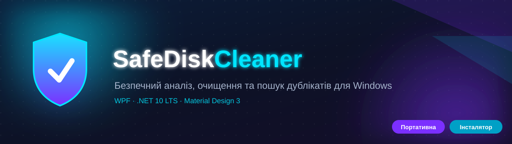
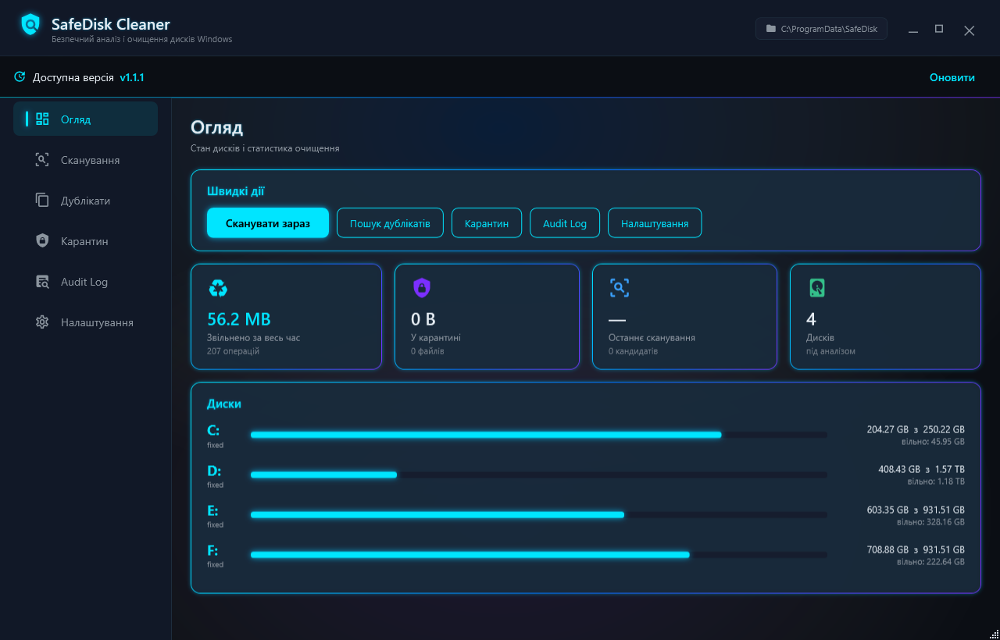
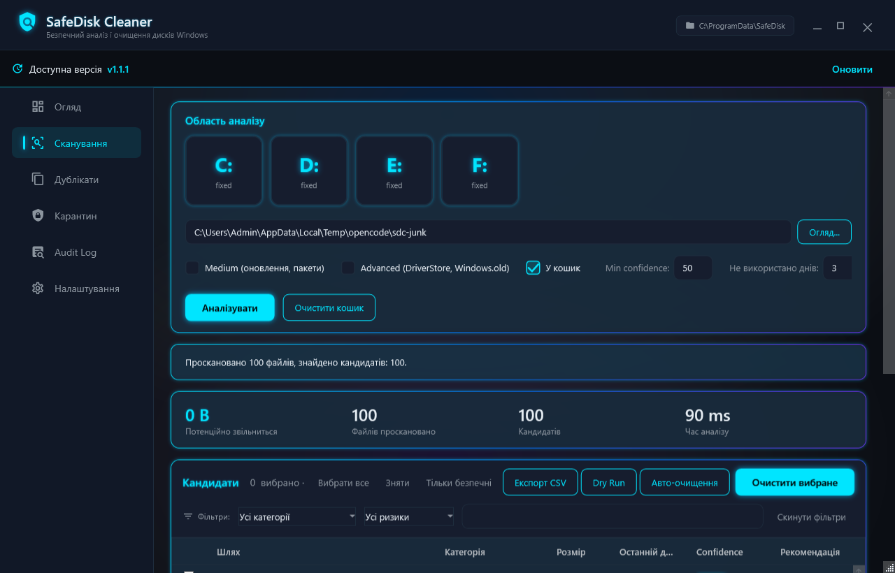
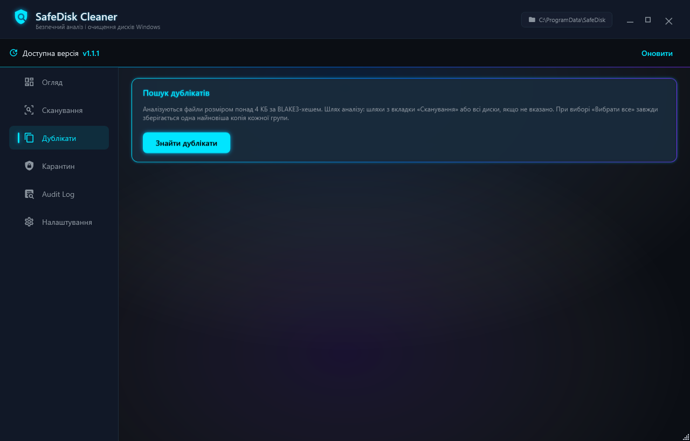
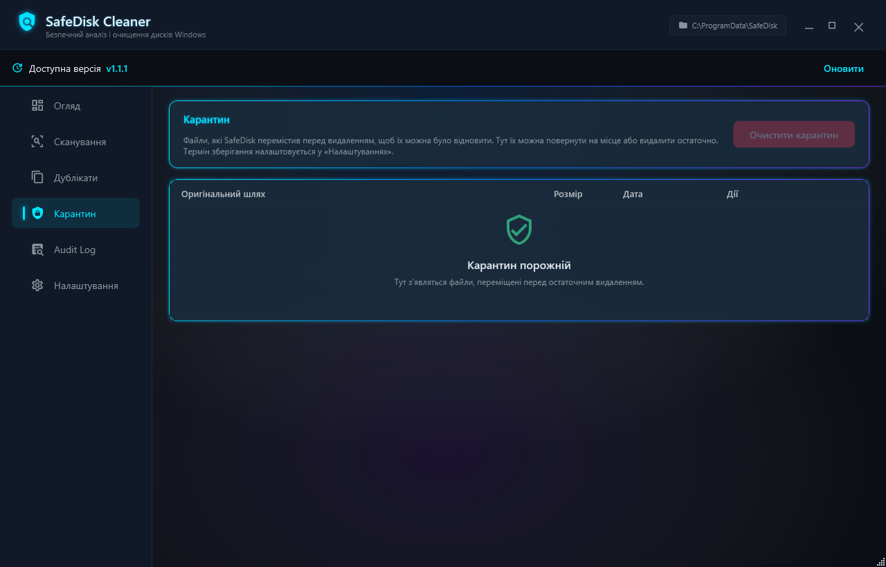
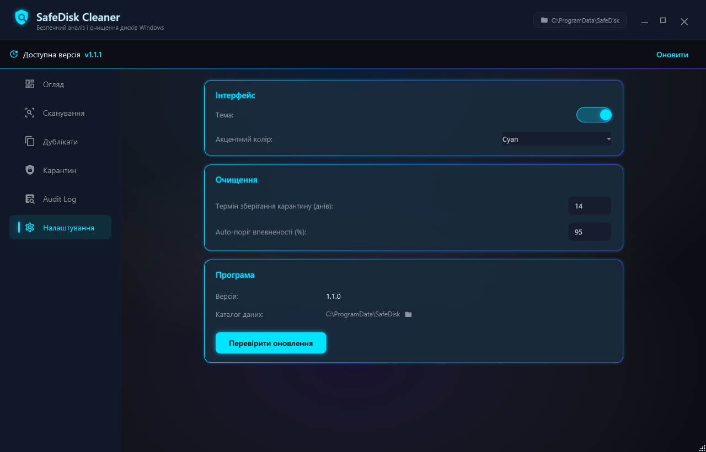

<div align="center">

# 🛡️ SafeDisk Cleaner

**Безпечний аналіз, очищення та пошук дублікатів для Windows**



[](https://github.com/ajjs1ajjs/SafeDisk-Cleaner/releases/latest)
[](https://github.com/ajjs1ajjs/SafeDisk-Cleaner/releases)
[](https://github.com/ajjs1ajjs/SafeDisk-Cleaner/actions)
[](https://github.com/ajjs1ajjs/SafeDisk-Cleaner/actions)
[]()
[]()
[](LICENSE)

**WPF · MVVM · Material Design 3 · .NET 10 LTS** — захищає ваші дані, дає повний контроль над кожним кроком очищення.

<a href="https://github.com/ajjs1ajjs/SafeDisk-Cleaner/releases/latest"></a>

</div>

---

## ✨ Чому SafeDisk Cleaner?

Інші «чистильники» видаляють файли наосліп. SafeDisk Cleaner будує **рейтинг безпеки для кожного файлу** та **ніколи не чіпає те, що може зламати систему**.

| | |
|---|---|
| 🧠 **Confidence System** | Кожен файл отримує оцінку `0–100%` із поясненням, чому його можна (чи не можна) видаляти. |
| 🛡️ **Safety Engine** | Не чіпає системні шляхи, захищені розширення, файли в роботі та підписи Microsoft. |
| 🔍 **Прозорість** | Ви бачите весь список, категорії, розміри, ризики та причини — **до** будь-якого видалення. |
| ♻️ **Recovery System** | Малі файли → Кошик, великі → Карантин з відновленням і журналом. |
| 📋 **Audit Log** | Повний журнал кожного очищення (SQLite). |
| 🎨 **Неоновий інтерфейс** | 2 теми × 4 акценти, темна та світла — перемикається миттєво. |

---

## 📸 Інтерфейс

<div align="center">

**Огляд (Dashboard)**



| | |
|---|---|
|  |  |
| **Сканування** — фільтри, ризики, експорт | **Дублікати** — BLAKE3-хеші, keep-one-per-group |
|  |  |
| **Карантин** — відновлення та очищення | **Налаштування** — тема та акцент |

</div>

---

## 🚀 Можливості

- **Scanner Engine** — багатопотоковий обхід і пошук сміття: Temp, Crash Dumps, Browser Cache, Logs, Package Cache, Windows Update cache, Windows.old, **Delivery Optimization**, **Error Reporting**, **Prefetch** та інші.
- **Пошук дублікатів** за BLAKE3-хешем; «Вибрати все» завжди залишає **одну найновішу копію** кожної групи.
- **4 режими очищення**: Analyze, Interactive, Auto, Dry Run.
- **Фільтри кандидатів** — пошук за шляхом, категорія, рівень ризику, «Тільки безпечні».
- **Експорт звіту** в CSV/JSON.
- **Очищення кошика Windows** одним кліком.
- **Автооновлення** з GitHub-релізів в один клік.
- **CLI** для сценаріїв автоматизації.

---

## 🔒 Основні принципи безпеки

Програма **ніколи** не видаляє:

- 📁 `Windows`, `Program Files`, `ProgramData`, `System32`, `Drivers`, `EFI`, `Recovery`, `Boot`
- 📄 файли з розширеннями `.dll .sys .exe .cat .inf .msi .msp`
- 🔐 файли з атрибутом `SYSTEM`, відкриті процесами або використані за останні N днів
- ✍️ файли з цифровим підписом Microsoft (Advanced-категорії)
- 🚫 пакети драйверів у Windows DriverStore — навіть якщо файл схожий на кеш

> Помилка під час очищення ніколи не перериває весь процес: невдалий файл логується в Audit, решта обробляється. Будь-яке очищення можна скасувати.

---

## 📥 Встановлення

Виберіть на [сторінці релізів](https://github.com/ajjs1ajjs/SafeDisk-Cleaner/releases/latest):

| Варіант | Файл | Опис |
|--------|------|------|
| 🧰 **Інсталятор** | `SafeDiskCleaner-<ver>-setup-win64.exe` | Встановлення в `%LOCALAPPDATA%\Programs`, ярлик у меню «Пуск», звичайне видалення. |
| 📦 **Портативна** | `SafeDiskCleaner-<ver>-portable-win64.exe` | Один файл, самостійна збірка. Запускається з будь-якого місця. |

---

## 💻 Розробка

### Системні вимоги

- Windows 10/11
- **.NET 10 SDK** (для розробки; готові збірки не потребують встановленого runtime)

### Збірка та запуск

```bash
dotnet restore
dotnet build -c Release            # збірка
dotnet run --project src/SafeDiskCleaner.App   # WPF UI
dotnet test                        # тести (97)
```

### CLI

```bash
dotnet run --project src/SafeDiskCleaner.Cli -- analyze --roots C:\Users\Me\AppData\Local\Temp
dotnet run --project src/SafeDiskCleaner.Cli -- clean --dry-run
dotnet run --project src/SafeDiskCleaner.Cli -- clean --auto
dotnet run --project src/SafeDiskCleaner.Cli -- duplicates --roots D:\
dotnet run --project src/SafeDiskCleaner.Cli -- drives
dotnet run --project src/SafeDiskCleaner.Cli -- audit
dotnet run --project src/SafeDiskCleaner.Cli -- quarantine list
dotnet run --project src/SafeDiskCleaner.Cli -- update
```

### Реліз

Тег `v*` запускає CI: тести → портативна збірка → інсталятор (Inno Setup) → автоматичне опублікування релізу.

```bash
git tag v1.1.1 && git push origin v1.1.1
```

---

## 🛠️ Стек

| Шар | Технологія |
|-----|------------|
| Платформа | **WPF, .NET 10 LTS** |
| UI | MaterialDesignInXamlToolkit (Material Design 3), темна/світла тема + 4 акценти |
| Архітектура | MVVM (CommunityToolkit.Mvvm), Dependency Injection, Generic Host |
| Дані | Entity Framework Core + SQLite |
| HTTP | HttpClientFactory + Refit + Polly (Retry/Timeout/Circuit Breaker) |
| Логування | Serilog (async sink, rolling file) |
| Валідація | FluentValidation |
| Хешування | BLAKE3 |
| Тести | xUnit + FluentAssertions + Moq |
| Релізи | GitHub Actions + Inno Setup |

---

## 📁 Де зберігаються дані?

| Що | Шлях |
|----|------|
| SQLite база (audit, карантин) | `C:\ProgramData\SafeDisk\SafeDisk.db` |
| Карантин | `C:\ProgramData\SafeDisk\quarantine\` |
| Звіти | `C:\ProgramData\SafeDisk\reports\` |
| Логи (Serilog) | `C:\ProgramData\SafeDisk\logs\` |
| Налаштування | `C:\ProgramData\SafeDisk\settings.json` |

> Якщо `C:\ProgramData` недоступний — використовується `%LOCALAPPDATA%\SafeDisk`.

---

## 📦 Структура проєкту

```
SafeDiskCleaner.sln
├── Directory.Build.props            # спільна версія
├── src/
│   ├── SafeDiskCleaner.Core/        # домен: моделі, rules, confidence, safety, scanner, Windows interop
│   ├── SafeDiskCleaner.Infrastructure/  # EF Core, Refit+Polly, Serilog, сервіси, DI
│   ├── SafeDiskCleaner.App/         # WPF UI (MaterialDesign, MVVM)
│   └── SafeDiskCleaner.Cli/         # консольний застосунок
├── scripts/                         # build-release.ps1, installer.iss
└── tests/
    └── SafeDiskCleaner.Tests/       # xUnit + FluentAssertions + Moq
```

---

## 🗺️ Дорожня карта

- [ ] Автозапуск при старті Windows
- [ ] Планувальник автоматичного очищення
- [ ] Сповіщення про завершення
- [ ] Локалізація (EN/UA/PL)

---

<div align="center">

**SafeDisk Cleaner** — MIT © [ajjs1ajjs](https://github.com/ajjs1ajjs)

⭐ Сподобалось? Поставте зірочку!

</div>
